<picture>
  <source media="(prefers-color-scheme: dark)" srcset="./dark.svg">
  <source media="(prefers-color-scheme: light)" srcset="./light.svg">
  
</picture>

## Hi, I'm Philip Alex Ambattu

I work at the intersection of Artificial Intelligence and Data Engineering, with professional experience in data integration, cloud automation, and analytics.

I'm currently pursuing an M.Sc. in Computer Science with a specialization in Artificial Intelligence at the University of Freiburg.

My recent work includes building a table tennis referee system powered by computer vision, evaluating AutoML and hyperparameter optimization methods, developing automation solutions, and contributing to an international dealer data integration project.

  <a href="https://www.linkedin.com/in/philip-alex-ambattu">LinkedIn</a> &nbsp;·&nbsp;
  <a href="mailto:ambattuphilipalex@gmail.com">Email</a> &nbsp;·&nbsp;
  <a href="https://github.com/ambattuphilipalex">GitHub</a>

### 🧰 Tech I work with
`Python` · `SQL` · `PyTorch` · `OpenCV` · `scikit-learn` · `NumPy` · `Pandas` · `C++`
`Google Cloud` · `BigQuery` · `Cloud Run` · `Cloud Functions` · `Databricks` · `Git` · `Linux`
